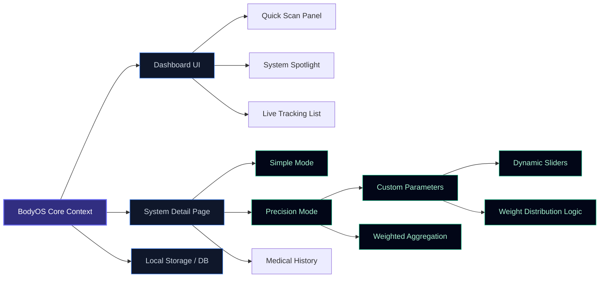
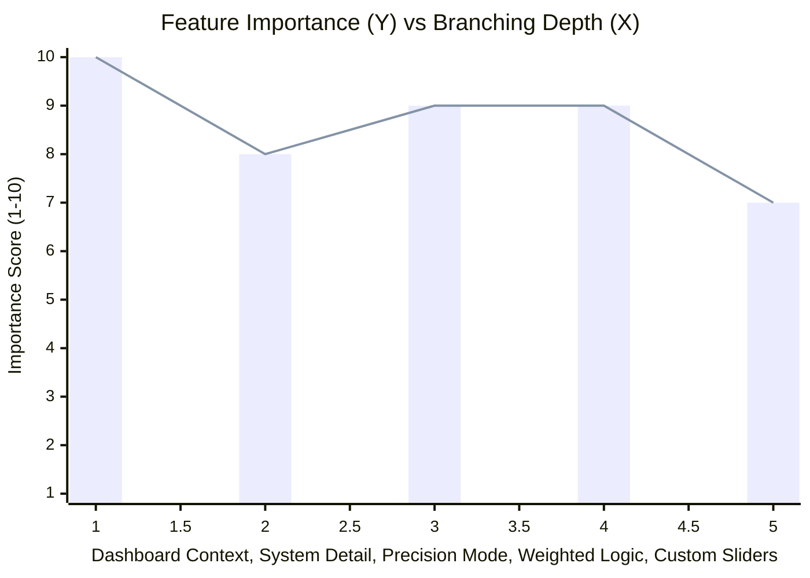

# Project Architecture & Importance Tracker

This document provides a hierarchical map of the system components and a matrix to evaluate their branching depth and actual importance.

## 1. Hierarchical Branching Map

This flowchart tracks what features have branched out from the core application, how deep they go, and how they connect.

---

## 2. Importance vs. Complexity (X-Y Tracking Matrix)

Use this matrix to map components across two dimensions:
- **X-Axis (Branching / Complexity Depth):** How far removed from core logic (1 = Core / Foundation, 10 = Deeply nested branch).
- **Y-Axis (Actual Importance / Impact):** How essential this is to the primary experience (1 = Nice-to-have / Distraction, 10 = Mission critical).

| Component / Feature | Branching Depth (X: 1–10) | Importance (Y: 1–10) | Category / Verdict | Action Required |
| :--- | :---: | :---: | :--- | :--- |
| **Dashboard State (`DashboardContext`)** | 1 | 10 | 🔴 Critical Foundation | Keep robust & minimal |
| **Precision Aggregation Logic** | 5 | 9 | 🟡 Core Value Driver | Maintain clean math |
| **Custom Parameter Sliders** | 6 | 8 | 🟡 Primary Interaction | Optimize UX/feel |
| **Medical Event & Symptom History** | 3 | 5 | 🟢 Secondary Feature | Keep as supplementary |
| **Quick Body Scan UI** | 2 | 4 | ⚪ Optional Utility | Review utility |
| **Sound Effects / Micro-animations** | 7 | 2 | ⚪ Polish / Non-essential | Keep lightweight |

---

## 3. Quantitative X-Y Visualization

---

## 4. Evaluation Checklist

When evaluating whether to keep, prune, or promote any feature:
- [ ] **Core Value Test (Y ≥ 7):** Does this directly serve the primary goal of the user?
- [ ] **Complexity Guard (X ≤ 6):** Is this branch getting too disconnected or difficult to maintain?
- [ ] **Prune / Simplify Flag:** If **Y < 5** and **X > 5**, it's an over-engineered branch — consider simplifying or removing it.
