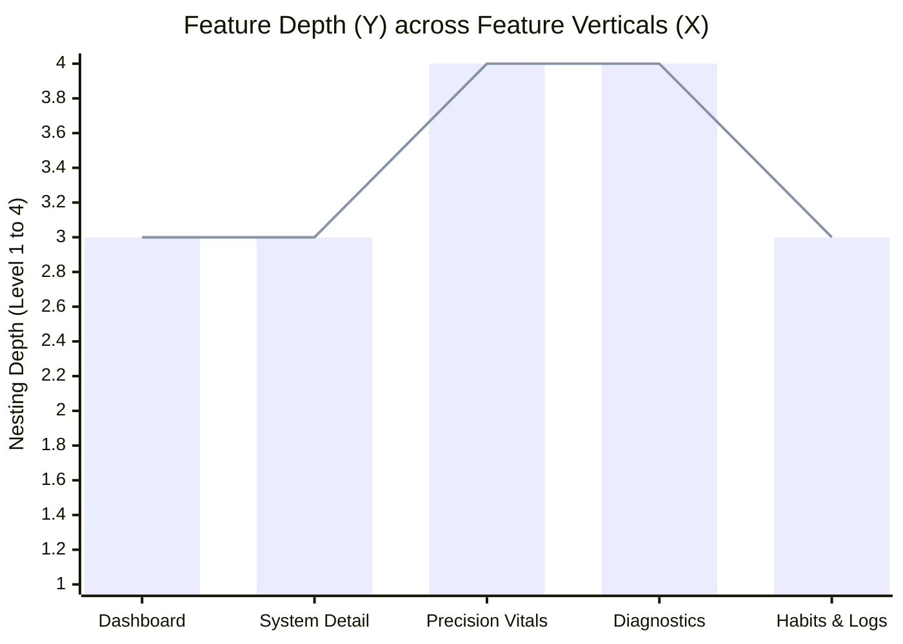

# Project Architecture & Feature Depth Tracker

This document maps the BodyOS architecture across **Diversity (X-Axis)** and **Depth (Y-Axis)** to help you visualize branching, spot over-engineered branches, and identify what is truly important versus fluff.

---

## 1. The X-Y Framework

```
Depth (Y-Axis)
▲
│ Level 4 │ [Deepest Sub-features: Algorithms, Micro-sliders, Dynamic Weighting]
│ Level 3 │ [Interactive Components: Modals, Forms, Timelines]
│ Level 2 │ [Page Sections: Panels, Score Cards, Trend Graphs]
│ Level 1 │ [Primary Modules: Dashboard, System Detail, Pulse]
│ Level 0 │ [Core Foundation: State Engine, LocalStorage, Types]
└─────────┴─────────────────────────────────────────────────────────────► Diversity (X-Axis)
          Feature 1       Feature 2       Feature 3       Feature 4
          (Dashboard)   (System Detail)  (Precision Vitals) (Body Pulse)
```

* **X-Axis (Diversity / Breadth):** The different feature verticals across the platform.
* **Y-Axis (Depth / Sub-feature Nesting):** How deep into sub-features, nested components, and granular logic each branch extends (Level 1 to Level 4).
* **Value Tag:** Whether the branch is **Critical (🔴)**, **High Value (🟡)**, **Supporting (🟢)**, or **Fluff/Prune (⚪)**.

---

## 2. Hierarchical Diversity & Depth Map

```mermaid
flowchart TD
    %% Level 0: Trunk
    Root["BodyOS Engine (DashboardContext & LocalStorage)"]

    %% Level 1: Diversity (X-Axis Spread)
    subgraph X1 ["X1: Overview Dashboard"]
        D_Main["Dashboard Page"]
        D_Map["Interactive 3D Body Map"]
        D_Spot["Spotlight & Quick Rating"]
        D_List["Live Systems Index"]
    end

    subgraph X2 ["X2: System Detail (Simple)"]
        S_Main["System Detail View"]
        S_Trends["Health Score Trend (Day/Wk/Mo/Yr)"]
        S_History["Timeline Event History"]
        S_Goals["Wellness Target Goals"]
    end

    subgraph X3 ["X3: Precision Vitals (Deepest Branch)"]
        P_Main["Precision Mode"]
        P_Params["Custom Parameters Engine"]
        P_Sliders["Dynamic Range Sliders"]
        P_Weights["Weighted Score Aggregator"]
    end

    subgraph X4 ["X4: Diagnostics & Audits"]
        A_Quick["Quick Body Scan (10s)"]
        A_Pulse["Body Pulse (3-Day Shift)"]
        A_Brief["Daily Health Brief"]
    end

    subgraph X5 ["X5: Clinical Habits & Logs"]
        H_Habits["Protective Protocols & Adherence"]
        H_Metrics["Vitals & Biometrics Logs"]
    end

    %% Connections showing Depth (Y-Axis)
    Root --> D_Main
    Root --> S_Main
    Root --> P_Main
    Root --> A_Quick
    Root --> H_Habits

    %% Depth Level 2 & 3
    D_Main --> D_Map
    D_Main --> D_Spot
    D_Main --> D_List

    S_Main --> S_Trends
    S_Main --> S_History
    S_Main --> S_Goals

    P_Main --> P_Params
    P_Params --> P_Sliders
    P_Params --> P_Weights

    A_Quick --> A_Pulse
    A_Pulse --> A_Brief

    H_Habits --> H_Metrics

    %% Importance Styling
    classDef critical fill:#312e81,stroke:#6366f1,stroke-width:2px,color:#fff;
    classDef highVal fill:#064e3b,stroke:#10b981,stroke-width:1.5px,color:#d1fae5;
    classDef secondary fill:#1e293b,stroke:#64748b,color:#cbd5e1;
    classDef deepBranch fill:#451a03,stroke:#f59e0b,stroke-width:2px,color:#fef3c7;

    class Root critical;
    class P_Main,P_Params,P_Sliders,P_Weights deepBranch;
    class D_Main,S_Main,D_Spot,S_Trends highVal;
    class D_Map,S_History,S_Goals,A_Quick,A_Pulse,A_Brief,H_Habits,H_Metrics secondary;
```



---

## 3. X-Y Feature Depth & Importance Matrix

| Feature Vertical (X-Axis) | Feature / Component | Depth (Y-Axis Level 1–4) | Importance (1–10) | Category | Prune or Keep? |
| :--- | :--- | :---: | :---: | :--- | :--- |
| **X1: Dashboard** | System Spotlight & Quick Rating | **L2** | **9/10** | 🔴 Critical | **Keep** — Core daily interaction |
| **X1: Dashboard** | Live Systems Index | **L2** | **8/10** | 🔴 Critical | **Keep** — Primary navigation |
| **X1: Dashboard** | Interactive Body Map | **L3** | **6/10** | 🟢 Supporting | **Keep** — Visual identity, but don't over-nest |
| **X2: System Detail** | Score Trend Graph (Day/Wk/Mo/Yr) | **L2** | **9/10** | 🔴 Critical | **Keep** — Key bio-feedback mechanism |
| **X2: System Detail** | Timeline & Medical History | **L3** | **6/10** | 🟢 Supporting | **Keep** — Good for audit trails |
| **X2: System Detail** | Simple Target Goals | **L3** | **5/10** | 🟢 Supporting | **Keep simple** — Don't branch further |
| **X3: Precision** | Custom Parameter Engine | **L2** | **10/10** | 🟡 Core Differentiator | **Keep** — Primary user customization |
| **X3: Precision** | Dynamic Range Sliders | **L3** | **9/10** | 🟡 High Value | **Keep** — Core input UX |
| **X3: Precision** | Weighted Aggregation Math | **L4** | **10/10** | 🟡 High Value | **Keep** — Essential calculation foundation |
| **X4: Diagnostics** | 10s Quick Body Scan Modal | **L2** | **8/10** | 🟡 High Value | **Keep** — Fast audit for busy users |
| **X4: Diagnostics** | Body Pulse 3-Day Shift | **L3** | **7/10** | 🟢 Supporting | **Keep** — Insights and momentum |
| **X4: Diagnostics** | Daily Health Brief | **L4** | **4/10** | ⚪ Fluff Candidate | **Prune / Simplify** — Potential duplicate of Pulse |
| **X5: Habits & Logs** | Protocol Adherence Sliders | **L2** | **7/10** | 🟢 Supporting | **Keep** — Actionable behavioral tracking |
| **X5: Habits & Logs** | Clinical Metric Logging (BP, HRV) | **L3** | **6/10** | 🟢 Supporting | **Keep** — Optional for power users |

---

## 4. Visual X-Y Chart (Diversity vs. Depth)



---

## 5. Pruning Decision Rule

Use this simple 2-question test for any sub-feature:

1. **Is Y (Depth) > 3, but Importance < 6?**
   * **Action: PRUNE / MERGE.** It is branched out too far and adding maintenance burden without user impact (e.g., duplicate modal views).
2. **Is Y (Depth) ≥ 3, and Importance ≥ 8?**
   * **Action: PROTECT & POLISH.** This is a core differentiator (like your Custom Precision Sliders & Weighted Aggregation). Ensure tests and types remain rock-solid.
